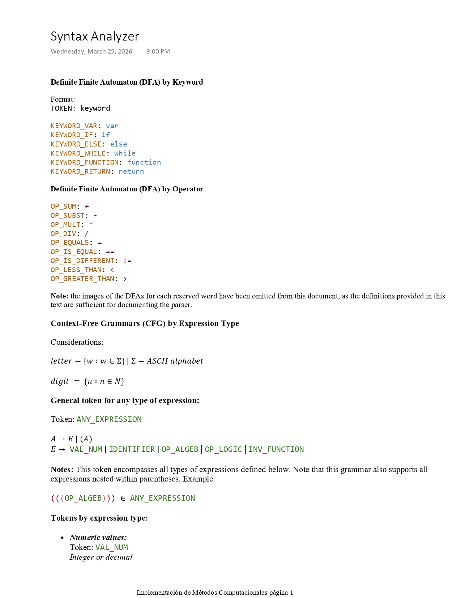
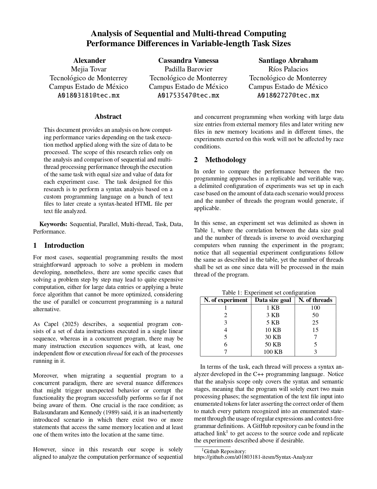

# Syntax Analyzer Processing through Sequential and Multi-Thread Programming Approaches

This project performs the syntax analysis (only Lexer and Parser stages) iteratively through each text file contained within /test directory in two different programming approaches; sequential and multi-thread.
Moreover, the program creates a new process to run Python scripts to analyze and plot the data of each experiment performance for research purposes.

## Prerequisites

Before trying to replicate the project experiments, ensure you have the following software installed:

- A Python interpreter (3.13 or superior). We strongly encourage to install Anaconda's environment since by default its Python interpreter already contains matplotlib and numpy libraries installed, which will make more straightforward the Python process creation through the C++ program.

Additionally, attached you can find a link to a compression format file that contains thousand of text files that you can use within the /test directory to ensure a proper test replication of the experiments listed in the project.

## Language Documentation

The definition and syntax of our programming language is explicitly detailed using Context-Free Grammars and Regular Expressions.

## Academic Paper Using Experimental Cases

Click the preview below to read the complete academic paper covering the performance and architectural benchmarks of the program after processing the experiments listed in the project.

